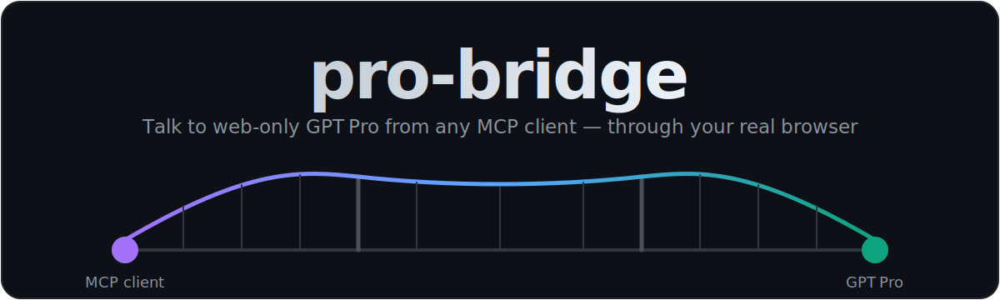
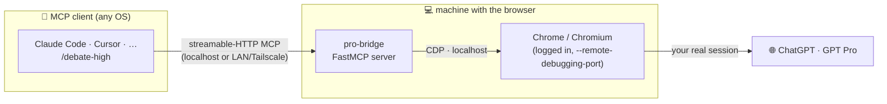

<div align="center">



<p>
  <a href="LICENSE"></a>
  
  
  
  
  <a href="https://github.com/alubato0127/pro-bridge/stargazers"></a>
</p>

<strong>Expose web-only GPT&nbsp;Pro — and any ChatGPT model — to any MCP client, through your real, logged-in browser.</strong>

<sub>Let Claude Code (or Cursor, or any MCP host) consult, debate, and collaborate with a model that has no API.</sub>

</div>

---

GPT&nbsp;Pro is one of the strongest reasoning models available — but it lives
**only in the ChatGPT web app**. No API, no SDK, no CLI. `pro-bridge` closes that
gap: it drives a model you're already paying for from your coding agent, so you
can bring the heavy artillery into an automated debate or a hard design review
without copy-pasting between windows.

It does this **without** a brittle scraper or a reverse-engineered private API.
It attaches to your **real** browser session over the Chrome DevTools Protocol,
so the genuine page handles login, cookies, and anti-bot tokens — and reads
answers from semantic DOM anchors that survive UI redesigns.

## Table of contents

- [Features](#features)
- [How it works](#how-it-works)
- [Quickstart](#quickstart)
- [Topologies](#topologies)
- [Configuration](#configuration)
- [Use it in Claude Code](#use-it-in-claude-code)
- [How it stays robust](#how-it-stays-robust)
- [Troubleshooting](#troubleshooting)
- [Roadmap](#roadmap)
- [Contributing](#contributing)
- [Disclaimer](#disclaimer)
- [License](#license)

## Features

- 🌉 **Reach web-only models** — GPT&nbsp;Pro and any model in your ChatGPT account, exposed as a clean MCP tool: `ask_gpt_pro(prompt, conversation_id?)`.
- 🔌 **Real session, no login flow** — attaches to your existing logged-in Chrome via CDP. Your genuine browser computes cookies and proof-of-work tokens, so detection surface is minimal and there's nothing to log in to.
- 🛡️ **Model verification** — reads the model that actually produced each answer (`data-message-model-slug`) and refuses anything that isn't a Pro model, so you never silently get a downgrade.
- 🧱 **Built to not break** — answers are read from semantic attributes + a text-stability check, not fragile CSS classes or the ever-changing SSE delta protocol. Only ~4 selectors couple to the UI, all documented.
- 🌐 **Any topology** — same machine (localhost) or client-on-a-headless-server + browser-on-your-laptop (over LAN/Tailscale). Same code, just a different URL.
- 💻 **Cross-platform host** — launch scripts for Windows, macOS, and Linux (Chrome / Chromium / Brave / Edge).
- 🔐 **Private by default** — bind to localhost, or put it behind a bearer token on a private network.
- 💬 **Batteries included** — ships with a `/debate-high` slash command that runs a structured Claude-vs-Pro debate.

## How it works

The browser automation stays on the machine that has the browser; only the MCP
request/reply travels — and on a single machine, nothing leaves it at all.



1. Your agent calls the `ask_gpt_pro` MCP tool with a self-contained prompt.
2. pro-bridge types it into the live ChatGPT composer and submits.
3. It waits for generation to finish (Pro reasons for minutes) and extracts the answer.
4. It verifies the answer came from a Pro model and returns `{text, model, conversation_id}`.
5. Pass `conversation_id` back to continue the same thread — that's what makes multi-round debate work.

## Quickstart

> Runs on the machine with the browser. Python 3.10+. No `playwright install`
> needed — it attaches to your existing browser.

```bash
git clone https://github.com/alubato0127/pro-bridge
cd pro-bridge
pip install -r requirements.txt
cp .env.example .env          # edit: set a token (or leave localhost-only)
```

**1. Start the bridge browser** (log in once; the profile persists):

```powershell
# Windows
powershell -ExecutionPolicy Bypass -File scripts\start-chrome-debug.ps1
```
```bash
# macOS / Linux  (auto-detects chrome/chromium/brave/edge; override with BROWSER=)
./scripts/start-chrome-debug.sh
```

In the window that opens, log into chatgpt.com and select your Pro model. Leave
it open (minimizing is fine).

**2. Sanity-check the connection** (sends nothing):

```bash
python selftest.py
# or a full round-trip (slow — Pro thinks for minutes):
python selftest.py "Reply with exactly one word: PONG"
```

**3. Run the server:**

```bash
python -m pro_bridge.server     # serves http://<host>:8765/mcp
```

Then [wire it into your client](#use-it-in-claude-code) — a **one-time** step.

> **After a reboot** you only need to bring the bridge back up; the client
> registration persists. Use the one-shot launcher:
> ```powershell
> powershell -ExecutionPolicy Bypass -File scripts\start-all.ps1   # Windows
> ```
> ```bash
> ./scripts/start-all.sh                                           # macOS / Linux
> ```
> To make it fully hands-off, add that launcher to your OS startup items
> (Windows Task Scheduler "at log on", or a macOS/Linux login item).

## Topologies

pro-bridge is network-transparent — run it wherever the logged-in browser is and
point your client at it. Same code in every case; only the URL changes.

| Client (Claude Code, …) | Browser host | `PRO_BRIDGE_HOST` | Client connects to |
|---|---|---|---|
| **Same machine** as the browser | same | `127.0.0.1` | `http://localhost:8765/mcp` |
| **Different machine** (e.g. headless server) | your laptop/desktop | `0.0.0.0` | `http://<host-LAN/Tailscale-IP>:8765/mcp` |

The browser host can be **Windows, macOS, or Linux**. The client can be any
MCP-capable tool on any OS. Same-machine? Skip the token (localhost only).
Cross-machine? Keep a token and put it behind a private network like Tailscale.

## Configuration

All via environment / `.env`:

| Variable | Default | Meaning |
|---|---|---|
| `PRO_BRIDGE_CDP_URL` | `http://localhost:9222` | CDP endpoint of the debug browser (local) |
| `PRO_BRIDGE_HOST` | `127.0.0.1` | bind address — `0.0.0.0` to expose across machines |
| `PRO_BRIDGE_PORT` | `8765` | MCP server port |
| `PRO_BRIDGE_TOKEN` | _(none)_ | if set, callers must send `Authorization: Bearer <token>` |
| `GPT_PRO_MODEL_SLUG` | _(current)_ | force a model on new chats (e.g. `gpt-5-pro`); empty = use selected |
| `PRO_BRIDGE_STRICT_MODEL` | `1` | refuse answers if the active model isn't a Pro model |
| `PRO_BRIDGE_TIMEOUT` | `1800` | max seconds to wait for one answer (Pro is slow) |

## Use it in Claude Code

**Same machine** (simplest — no token):
```bash
claude mcp add --transport http gpt-pro http://localhost:8765/mcp --scope user
```

**Different machine** (client on a server, browser on your laptop):
```bash
claude mcp add --transport http gpt-pro \
  http://<browser-host-ip>:8765/mcp --scope user \
  --header "Authorization: Bearer <PRO_BRIDGE_TOKEN>"
```

The tool shows up as `mcp__gpt-pro__ask_gpt_pro`. Drop
[`commands/debate-high.md`](commands/debate-high.md) into your
`~/.claude/commands/` to get a `/debate-high` command that runs a structured
Claude-vs-Pro debate:

```
/debate-high Should this RL reward use potential-based shaping or a raw bonus?
```

## How it stays robust

The two design decisions that keep this from rotting like a typical scraper:

| Failure mode of naive scrapers | What pro-bridge does instead |
|---|---|
| Bot detection / login walls | Attaches to your **real** logged-in browser (CDP); the genuine page produces cookies and anti-bot tokens |
| Reading the answer off fragile CSS classes | Reads the assistant turn by its **semantic attribute** (`data-message-author-role`) + a text-stability settle |
| Parsing the volatile streaming/delta protocol | Doesn't — waits for the stop indicator to clear and the text to stop changing |
| Silently getting a weaker model | **Verifies** the producing model from `data-message-model-slug`; refuses non-Pro |
| Guessing completion of a long "thinking" turn | Pure polling with a generous timeout — no single locator wait that can hang |

When ChatGPT does redesign, only a handful of selectors in
[`pro_bridge/chatgpt.py`](pro_bridge/chatgpt.py) need a touch — the bundled
`probe_dom.py` / `debug_ask.py` tools locate the new ones in seconds.

## Troubleshooting

| Symptom | Fix |
|---|---|
| `selftest.py` can't connect | Browser isn't running with `--remote-debugging-port`, or wrong `PRO_BRIDGE_CDP_URL`. Re-run the launch script. |
| `421 Invalid Host header` | MCP DNS-rebinding guard — already disabled in `server.py`; make sure you're on the latest version. |
| Health check `Failed to connect` from a remote client | Check the host firewall / Tailscale ACL, and that `PRO_BRIDGE_HOST=0.0.0.0`. |
| "Refusing answer: … not a Pro model" | Select GPT Pro in the bridge browser, or set `GPT_PRO_MODEL_SLUG`. |
| Model slug changed after a ChatGPT update | Run `python selftest.py` — it logs the live slug — and update `.env`. |
| Selectors broke after a redesign | Run `python probe_dom.py`, paste output, update the few selectors in `chatgpt.py`. |

## Roadmap

- [ ] Multiple model tools in one server (`ask_gpt_pro`, `ask_gpt_thinking`, …)
- [ ] Adapters for other web-only models (Gemini Ultra, Grok, …)
- [ ] Streaming partial responses back to the client
- [ ] A three-way orchestrator (Claude ⇄ Codex ⇄ GPT Pro round-table)
- [ ] One-command installer / packaged service

Contributions toward any of these are very welcome.

## Contributing

Issues and PRs welcome. The codebase is small and readable —
`pro_bridge/chatgpt.py` is the browser driver, `pro_bridge/server.py` is the MCP
server, and the `probe_*` / `debug_*` scripts help when the UI shifts. Please
keep the "don't couple to fragile UI" principle when adding selectors.

## Disclaimer

This automates the ChatGPT web UI of **your own** account. That's a gray area
under OpenAI's terms of service — **use at your own risk**. It is not affiliated
with, endorsed by, or sponsored by OpenAI or Anthropic. "GPT", "ChatGPT", and
"Claude" are trademarks of their respective owners.

## License

[MIT](LICENSE) © 2026 Kuanyen Liu
